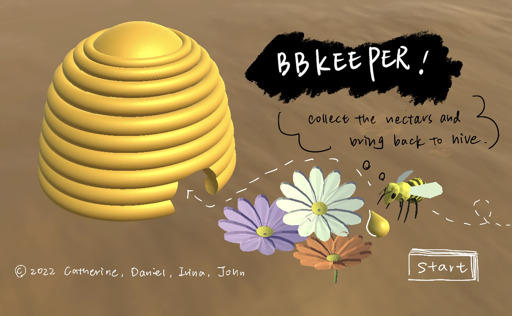
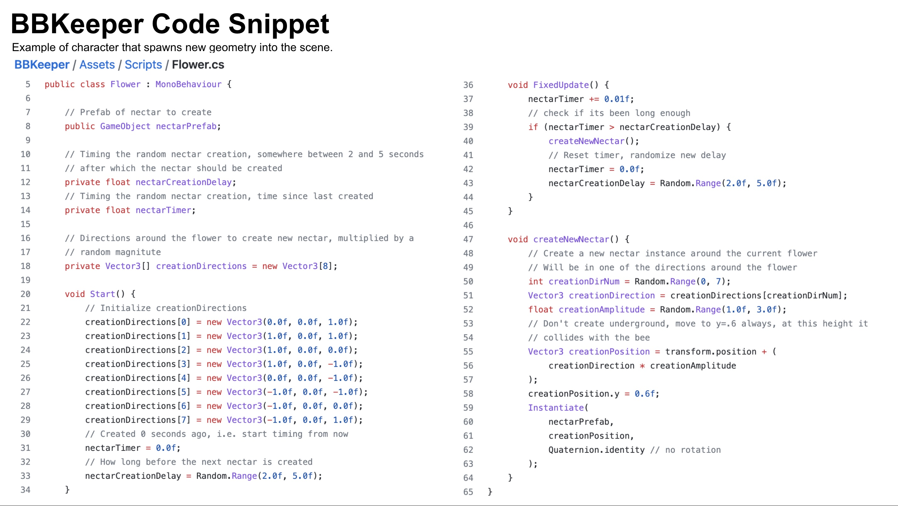
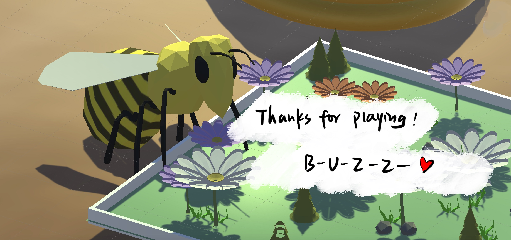

# [BBKeeper](https://daniel65.itch.io/bbkeeper-3)

*Game created by Irina, Catherine, John, and Daniel*

[Try Playing it](https://daniel65.itch.io/bbkeeper-3)

**Technologies** C#, Unity, Blender

**Responsibilities**
- Code for timer, nectar spawning, and scene structure
- Art for models and UI

## Project Bio
This is a 3D bee experience-simulating game for collecting nectar and making honey! Users navigate the garden and collect nectars in a given time frame. 	

Become a bee and carry out your bee duties by navigating obstacles in your environment, searching for nectar, and bringing it back to your hive!

## Project Snapshots

